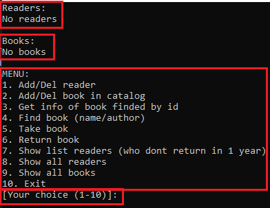
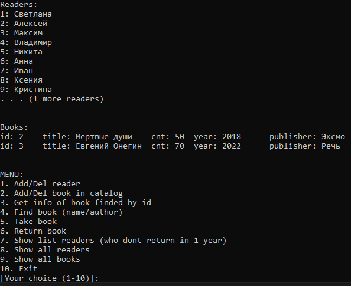
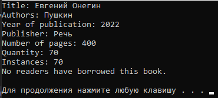

# Программа работы с библиотечным каталогом

## 1 Описание работы программы

При запуске программы открывается меню:
- `Readers` - cписок читателей
- `Books` - Список книг
- `Menu` - Само меню с действиями 
- Поле, ожидающее ввод номера действия (`[Your choice (1-10)]:`)



Рис. 1 - Меню программы

Какие действия предлагает выполнить меню?
1. Добавить или удалить читателя
2. Добавить или удалить книгу
3. Найти книгу по ее `id` и посмотреть ее подробное описание, а также список читателей, взявшие эту книгу
4. Найти книгу по ее названию или автору (`title`, `author`)
5. Выдать книгу читателю
6. Вернуть книгу в каталог
7. Показать список читателей, которые не возвращали книгу более года
8. Показать полный список читателей
9. Показать полный список книг
10. Выйти из программы

Выбор действия осуществляется путем **ввода номера действия** и **нажатием клавиши `[Enter]`**

## 1.1 Добавить или удалить читателя

Для добавления читателя, в меню выбираем второе действие, а затем в меню добавления/удаления читателя выбираем первое действие (добавление)


Рис. 2 - Добавление или удаление читателя

Для удаления читателя выбираем второе действие и вводим id читателя

## 1.2 Добавить или удалить книгу

Для добавления книги, в меню выбираем второе действие, а затем в меню добавления/удаления книги выбираем первое действие (добавление)

Затем вводим:
- Название книги
- Авторы книги (Если авторов 2 или более, вводим их одной строкой через запятую)
- Год публикации книги
- Название издательства
- Количество страниц
- Количество экземпляров книги


Рис. 3 - Добавление книги

Для удаления книги выбираем второе  действие и вводим id книги



Рис. 4 - Вот так выглядит меню с заполненными данными

## 1.3 Найти книгу

Выбираем в меню третье действие


Рис. 4 - Поиск книги по id

Выбираем в меню четвертое действие (результат поиска будет после нажатия на любую клавишу)


Рис. 5 - Поиск книги по id

Выбираем в меню четвертое действие (результат поиска будет после нажатия на любую клавишу)


Рис. 6 - Поиск книги по id



Рис. 7 - Результат выполнения действия 4

## 1.3 Выдача/возврат книги

Для выдачи книги выбираем пятое действие книги и вводим id читателя и книги


Рис. 8 - Ввод для действий 5,6


Рис. 9 - Результат выдачи книги

## 2 Разбор кода

Код состоит из двух классов - Book и CatalogBook (наследник Book)

```cpp
/* Класс книги

Свойства:
title (строка) - название книги;
authors (вектор строк) - массив авторов книги;
year (целое беззнаковое) - год издания книги;
publisher (строка) - издательство;
numPages (целое беззнаковое) - количество страниц.
*/
class Book
{
public:
    string title;
    vector<string> authors;
    unsigned int year;
    string publisher;
    unsigned int numPages;
};
```
```cpp
/* Класс каталога - наследник книги

Свойства:
id (целое беззнаковое) - id книги;
quantity (целое беззнаковое) - общее количество книг;
instances (целое беззнаковое) - экземпляров на лицо;
picked (вектор пар - строка, дата и время) - массив, список читалей и дата, когда они брали книгу.

Конструкторы:
CatalogBook без параметров;
CatalogBook c параметрами id, book, quantity.

Методы:
lendBook - выдача книгу читателю;
returnBook - возвращение книгу в каталог;
isOverdue - проверка нарушения срока выдача книги.
*/
class CatalogBook : public Book
{
public:
    unsigned int id;
    unsigned int quantity;
    unsigned int instances;
    vector<pair<string, time_t>> picked;

    CatalogBook()
    {
        id = 0;
        quantity = 0;
        instances = 0;
    }

    CatalogBook(unsigned int _id, const Book &book, unsigned int _quantity) : Book(book), id(_id), quantity(_quantity), instances(_quantity) {}

    void lendBook(string &readerName);
    void returnBook(string &readerName);
    bool isOverdue(const string &readerName, const time_t &dueDate) const;
};
```

Два глобальных вектора каталога и читателей, для них мы выполняем действия:
- Добавление/удаление
- Для книг поиск по id, названию и автору
- Для читателей выдача и возврат книги
```cpp
vector<CatalogBook> catalog; // Глобальный вектор книг каталога
vector<string> readers;      // Глобальный вектор читателей
```

Далее расписываем методы класса каталога книг

```cpp
// Выдача книги
// Параметр - readerName (строка) - читатель
void CatalogBook::lendBook(string &readerName)
{
    if (instances > 0)                                          // Нельзя выдать книгу, если ее нет
    {
        instances--;                                            // Уменьшает количество книг на 1 при выдаче книги
        picked.push_back(make_pair(readerName, time(nullptr))); // Для книги добавляет в список читателя, который ее взял и дату выдачи (текущая дата и время)
    }
}
```

```cpp
// Возрат книги
// Параметр - readerName (строка) - читатель
void CatalogBook::returnBook(string &readerName)
{
                            // Ищем читателя у книги
                            // В функции find_if используется лямбда выражение
    auto it = find_if(picked.begin(), picked.end(),
                      [&](const pair<string, time_t> &p)
                      {
                          return p.first == readerName;
                      });
    if (it != picked.end()) // Если читатель брал книгу
    {
        instances++;        // Увеличиваем количество экземпляров книги
        picked.erase(it);   // Удаляем читателя из списка этой книги
    }
}
```

```cpp
/* Проврека на нарушение сроков выдачи
Параметры:
readerName (строка) - читатель
dueDate (дата и время) - дата возврата
*/
bool CatalogBook::isOverdue(const string &readerName, const time_t &dueDate) const
{
    // В функции find_if используется лямбда выражение
    auto it = find_if(picked.begin(), picked.end(),
                      [&](const pair<string, time_t> &p)
                      {
                          return p.first == readerName;
                      });
    if (it != picked.end())
    {
        time_t now = time(nullptr);
        return now > dueDate;
    }
    return false;
}
```

```cpp
/* Поиск книги по названию
Параметр - title (строка) - название
*/
vector<unsigned int> findBookByTitle(const string &title)
{
    // Обычный перебор через цикл без лямбда выражений
    vector<unsigned int> result;
    for (unsigned int i = 0; i < catalog.size(); i++)
    {
        if (catalog[i].title == title)
        {
            result.push_back(catalog[i].id);
        }
    }
    return result;
}
```

```cpp
/* Поиск книги по автору
Параметр - author (строка) - автор
Работает аналогично прошлому методу
*/
vector<unsigned int> findBookByAuthor(const string &author)
{
    vector<unsigned int> result;
    for (unsigned int i = 0; i < catalog.size(); i++)
    {
        for (auto j : catalog[i].authors)
        {
            if (j == author)
            {
                result.push_back(catalog[i].id);
            }
        }
    }
    return result;
}
```

```cpp
// Итератор id книги (работатет статически)
unsigned int getNextId()
{
    static unsigned int nextId = 1;
    return nextId++;
}

// Добавление книги в каталог
void addBookToCatalog()
{
    // Вводим данные
    CatalogBook book;
    book.id = getNextId();
    cout << "Enter book title: ";
    getline(cin, book.title);
    getline(cin, book.title);
    cout << "Enter author names separated by commas: ";
    string authorNames;
    getline(cin, authorNames);
    string delimiter = ",";
    size_t pos = 0;
    // Парсим авторов из строки
    while ((pos = authorNames.find(delimiter)) != string::npos)
    {
        book.authors.push_back(authorNames.substr(0, pos));
        authorNames.erase(0, pos + delimiter.length());
    }
    book.authors.push_back(authorNames);
    cout << "Enter year of publication: ";
    cin >> book.year;
    cin.ignore(); // ignore newline
    cout << "Enter publisher: ";
    getline(cin, book.publisher);
    cout << "Enter number of pages: ";
    cin >> book.numPages;
    cout << "Enter quantity: ";
    cin >> book.quantity;
    book.instances = book.quantity;
    catalog.push_back(book);
    cout << "Book added to catalog with ID " << book.id << endl;
}
```

```cpp
// Удаление книги из каталога
void removeBookFromCatalog()
{
    cout << "Enter book ID: ";
    unsigned int bookId;
    cin >> bookId;
    // Поиск книги по id осуществляется с помощью лямбда выражения
    auto it = find_if(catalog.begin(), catalog.end(),
                      [&](const CatalogBook &book)
                      {
                          return book.id == bookId;
                      });
    if (it != catalog.end())
    {
        catalog.erase(it);
        cout << "Book removed from catalog." << endl;
    }
    else
    {
        cout << "Book not found in catalog." << endl;
    }
}
```

Остальные функции чисто информационные