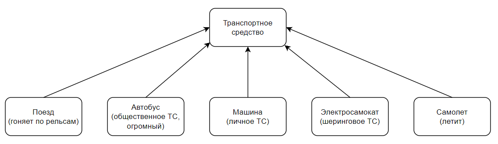

## Описание программы

В программе создается vector из пяти объектов класса Point3D (Точка с координатами XYZ) и фишка в том, что каждый объект имеет свой тип данных,
у первого элемента координаты XYZ - типа double, у второго - int, у третьего - short, четвертый - float, пятый - long.
Также в векторе есть шестой элемент, у него XYZ типа char

Программа использует следующие классы и шаблоны:

### Класс `base`

- Описывает базовый класс с виртуальным методом `show`, который будет перегружаться в других классах.
- Данный класс не содержит полей или реализации методов, а только определение виртуального метода.

### Шаблон класса `Point2D<T>`

- Представляет точку в двумерном пространстве с координатами X и Y.
- Класс параметризован типом данных `T`, позволяющим использовать различные типы данных для координат.
- Конструктор класса принимает значения координат X и Y и инициализирует соответствующие поля класса.

### Шаблон класса `Z<T>`

- Представляет ось координат Z в трехмерном пространстве.
- Класс параметризован типом данных `T`, позволяющим использовать различные типы данных для координаты Z.
- Конструктор класса принимает значение координаты Z и инициализирует соответствующее поле класса.

### Шаблон класса `Point3D<T>`

- Представляет точку в трехмерном пространстве, наследуя класс `Point2D<T>` и `Z<T>`.
- Добавляет третье измерение в двумерное пространство, предоставляемое классом `Point2D`.
- Также наследует класс `base` и переопределяет его метод `show`.
- Конструктор класса принимает значения координат X, Y и Z и инициализирует соответствующие поля класса.
- Метод `show` выводит значения координат X, Y и Z на экран.

### Функция `main`

- В функции `main` создаются объекты классов `Point3D` с различными типами данных для координат.
- Демонстрируется использование полиморфизма, сохраняя объекты в векторе указ

ателей на базовый класс `base`.
- Вектор `zadanie` содержит пять элементов, каждый из которых является объектом класса `Point3D` с разным типом данных для координат.
- После этого вызывается метод `show` для каждого объекта вектора `zadanie`, выводящий значения координат на экран.

## Паттерн проектирования: полиморфизм

Полиморфизм - это паттерн проектирования, который позволяет использовать объекты разных классов с общим базовым интерфейсом, при этом вызывая специфические для каждого класса методы. Это достигается с помощью виртуальных функций и наследования.

Пример полиморфизма

В данной программе паттерн полиморфизма реализуется через наследование класса `base` и переопределение его виртуального метода `show` в классе `Point3D`. Затем объекты класса `Point3D` сохраняются в векторе указателей на базовый класс `base`, и вызов метода `show` для каждого элемента вектора приводит к вызову соответствующей реализации метода для каждого класса.

Это позволяет обрабатывать объекты разных типов, наследующих базовый класс, с помощью единого интерфейса, что упрощает расширение и поддержку кода.